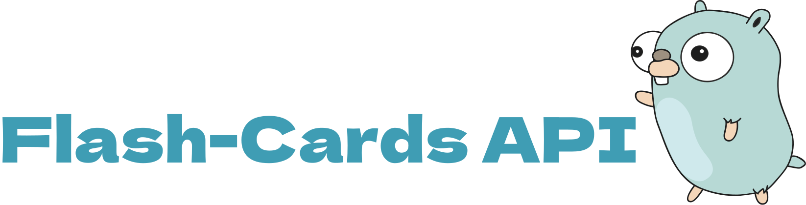

# Flash-Cards API

**Description**: An API in Golang for creating, managing, and effectively studying flash-cards.

<p align="center">
  
</p>

## Table of Contents

- [Requirements](#requirements)
- [Setup](#setup)
- [Database](#database)
- [Usage](#usage)
- [Examples](#examples)
- [Contribution](#contribution)

## Requirements

- [Golang](https://golang.org/) (version 1.19 or higher)
- Database (Mysql 8)
- Docker

## Database

1. A simple image description of our database:

<p align="center">
  
</p>

## Setup

1. Clone the repository:

```bash
git clone https://github.com/andremartinsds/flash-cards-api
```

## Usage

1. Navigate to the project folder:

```bash
cd flash-cards-api
```

2. Configure environment variables:

Create a .env file in the project's root and set the necessary environment variables, such as database credentials and server settings.

```bash
APPLICATION_PORT=""

HOST=""
MYSQL_USER=""
MYSQL_ROOT_PASSWORD=""
MYSQL_DATABASE=""
MYSQL_PASSWORD=""
PORT=""
```

3. Install dependencies:

```bash
go mod tidy
```

4. Execute docker-compose:

```bash
docker-compose up
```

5. Run api

In this case you can run the flash-cards-api with:

```bash
go run main.go
```

if you want execute with swagger you can run with make like:

```bash

<!-- TODO: add swagger -->

```

## Examples

<!-- TODO: add swagger -->

## Contribution

fell free to send a pull request

## Author

André Martins
